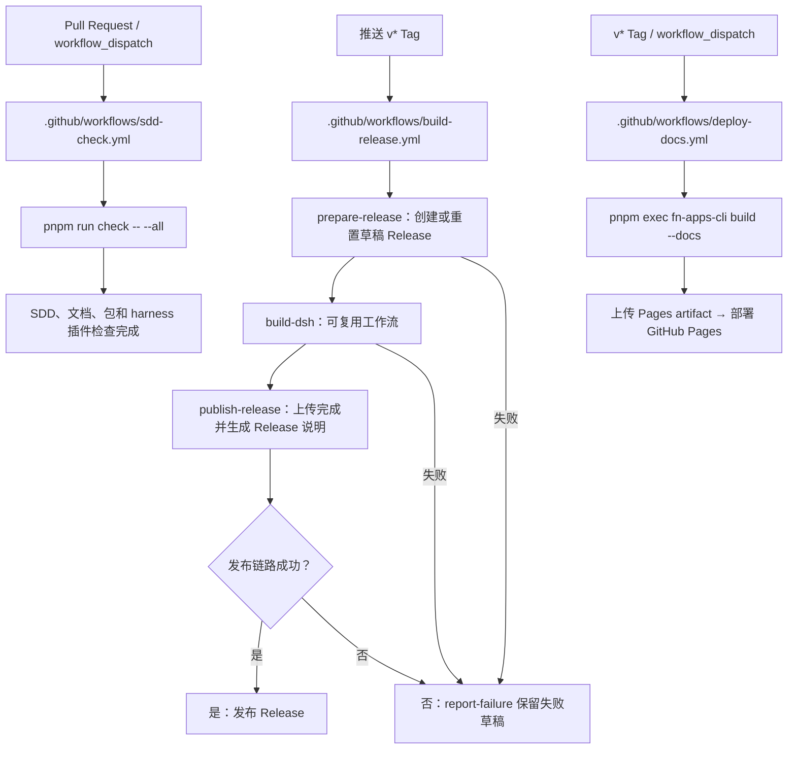
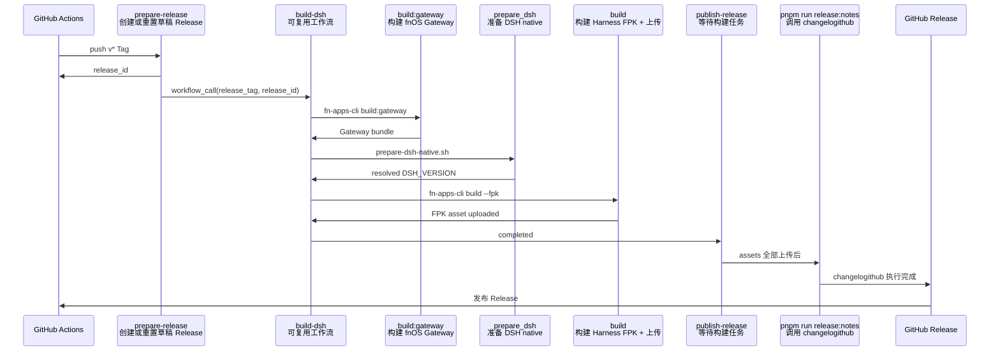
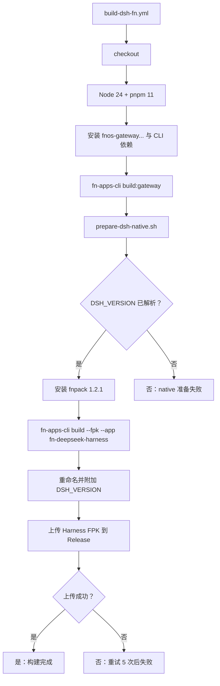
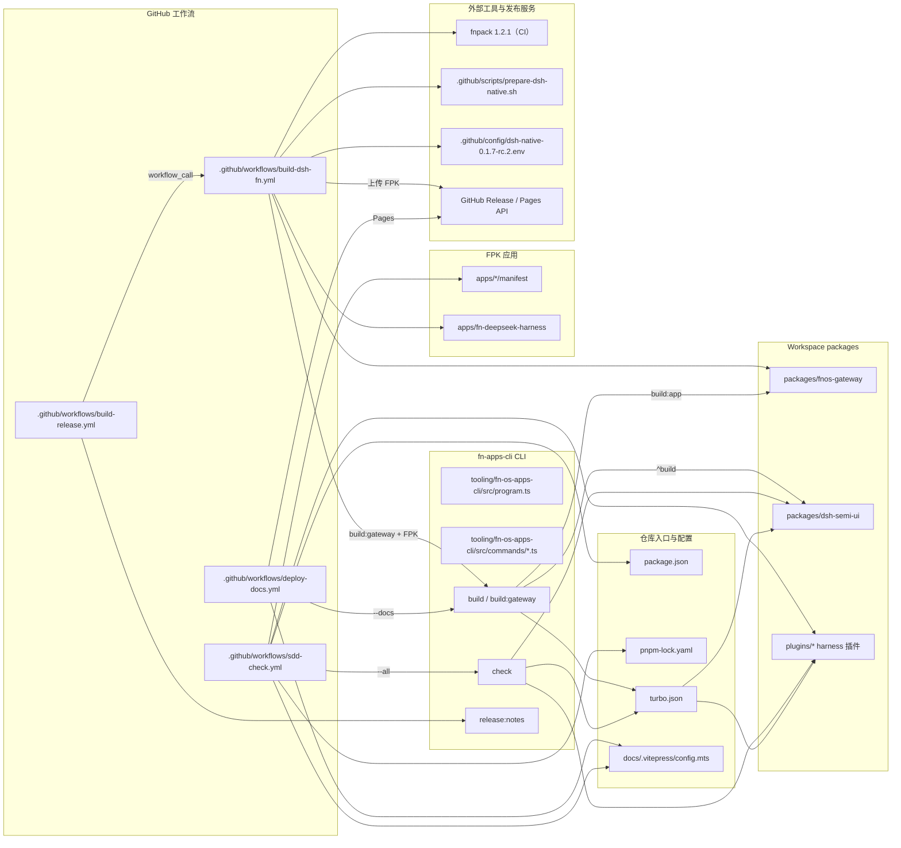

# GitHub 工作流

本页说明 `.github/workflows/` 当前有效的 GitHub Actions，以及它们与仓库文件、包和外部工具的依赖关系。

## 工作流总览

当前自动化分成三条路径：

- `v*` Tag 触发发布链路，构建 FPK 并发布 GitHub Release。
- Pull Request 或手动触发质量链路，检查 SDD、文档、共享包和 harness 插件。
- `v*` Tag 或手动触发文档部署链路，构建并部署 VitePress。



## 两个发布任务的时序

`prepare-release` 完成后，`build-dsh` 作为可复用工作流执行；它完成后 `publish-release` 才会继续。



### `changelogithub` 的执行时机

Release 日志不是在 `build-dsh-fn.yml` 中生成的，而是在 `build-release.yml` 的 `publish-release` 任务中执行。具体顺序是：

1. `prepare-release` 创建或重置草稿 Release，并输出 `release_id`。
2. `build-dsh` 构建并上传 Harness FPK。
3. 构建任务成功后，`publish-release` 开始发布任务；成功路径不再写入自定义 Release `name/body`。
4. `publish-release` 设置 Node.js / pnpm，安装 CLI 依赖。
5. 执行 `pnpm run release:notes`，由 `fn-apps-cli release:notes` 调用 `changelogithub`，生成并写入完整 Release `name/body`。
6. Release 日志生成完成后，GitHub Release 才会被发布；失败路径只把诊断信息写入 Actions Summary，并保留草稿。

成功路径不再通过 `gh api` 写入自定义 Release `name` 或 `body`，避免与 `changelogithub` 的完整更新结果产生覆盖或拼接耦合。失败信息属于运行诊断，写入 `$GITHUB_STEP_SUMMARY`，不作为 Release 日志内容。

### `build-dsh-fn.yml` 内部步骤



`build-dsh-fn.yml` 只接受 `workflow_call`，不会自行响应 push；它必须由 `build-release.yml` 传入 `release_tag` 和 `release_id`。

## 工作流与文件、包的依赖关系

下图只展示运行时真正读取或调用的边界：工作流调用 CLI，CLI 再调用 Turbo、VitePress、fnpack 或包内脚本；应用的 `manifest` 决定是否进入 FPK 矩阵。



## 各工作流的职责

| 工作流 | 触发方式 | 主要职责 | 关键输入 |
| --- | --- | --- | --- |
| `build-release.yml` | 推送 `v*` Tag | 创建草稿 Release、调用 FPK 构建、发布 Release | `github.ref_name`、Release ID |
| `build-dsh-fn.yml` | 仅 `workflow_call` | 构建 Gateway、准备 DSH native、构建 Harness FPK | `release_tag`、`release_id`、native 配置 |
| `deploy-docs.yml` | `v*` Tag / 手动 | 构建 VitePress 并部署 GitHub Pages | `DOCS_BASE=/` |
| `sdd-check.yml` | Pull Request / 手动 | 执行完整 SDD、文档、包和 harness 插件检查 | 变更路径 |

## 发布链路

### 1. 创建版本 Tag

版本命令由根 CLI 执行，项目/FPK 使用 `v<版本号>` Tag：

```bash
pnpm run version -- project patch
git push origin main
git push origin v<版本号>
```

### 2. 构建 DeepSeek Harness FPK

`build-dsh-fn.yml` 的顺序不能省略：

1. 安装 Gateway 和 FPK 构建依赖。
2. 执行 `pnpm exec fn-apps-cli build --fpk --app fn-deepseek-harness --bundle-dsh-native --skip-bundle-dsh-plugins`，由构建流程先编译 Gateway，再按 `.github/config/dsh-native-0.1.7-rc.2.env` 准备并内置 native 依赖。
3. 按 Release Tag 和 DSH 版本重命名并上传 FPK。

### 3. 发布 Release

Harness FPK 上传成功后，`publish-release` 执行根 `release:notes`：

```bash
pnpm run release:notes
```

任一阶段失败时，`report-failure` 会将阶段状态写回草稿 Release；草稿不会被误发布。

## 文档与 SDD 链路

文档和 SDD 工作流都会构建 VitePress，因此页面里的 Mermaid 图会一并渲染：

```bash
pnpm run build -- --docs
pnpm run check -- --all
```

- `deploy-docs.yml` 构建 `docs/.vitepress/dist`，上传后由 `deploy-pages` 发布。
- `sdd-check.yml` 对 Pull Request 的指定路径执行完整 `check --all`。
- 只修改 `apps/**` 时，仍会触发 SDD 工作流，因为它在路径过滤器中；FPK 的真实安装行为还必须在 fnOS 设备上验收。

## 修改工作流的检查清单

- [ ] 新增或修改触发器后，更新本页的触发条件和总览图。
- [ ] 可复用工作流的输入、输出和 `needs` 关系保持一致。
- [ ] FPK 构建继续通过 `fn-apps-cli` 和 `fnpack`，不在工作流中复制 CLI 逻辑。
- [ ] 版本、DSH native 和 fnpack 版本来源与配置文件保持一致。
- [ ] 文档或 Mermaid 图改动通过 `pnpm run build -- --docs`。
- [ ] 提交前运行 `pnpm run check -- --all`。
- [ ] 不把 `.fpk`、native 临时目录或 GitHub Token 写入仓库。

## 相关文档

- [开发环境](./environment)
- [Turbo 任务](./turbo-tasks)
- [CI 构建](../build/ci)
- [版本管理](../build/versioning)
- [发布流程](../build/release)
